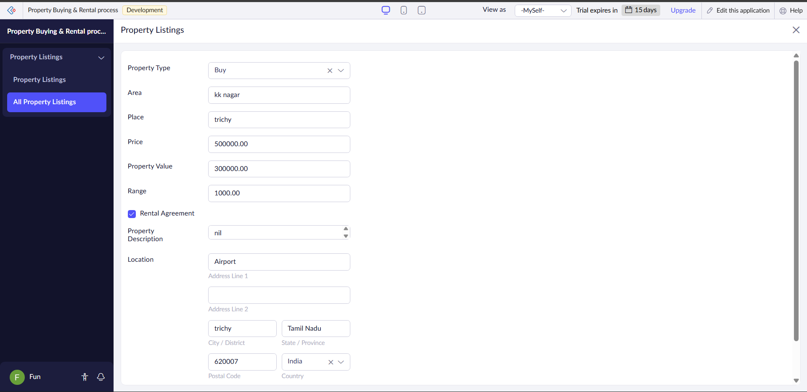
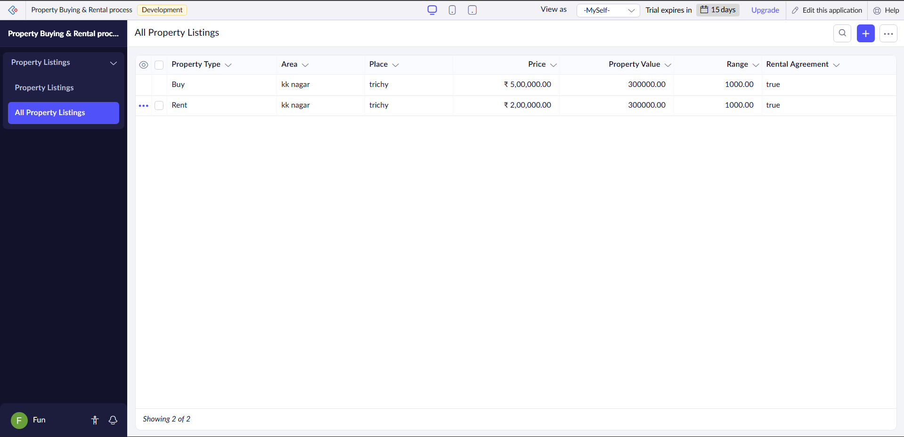
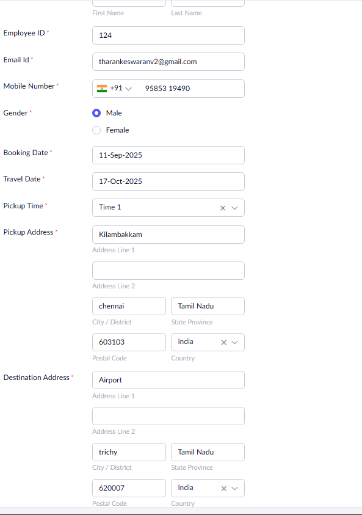
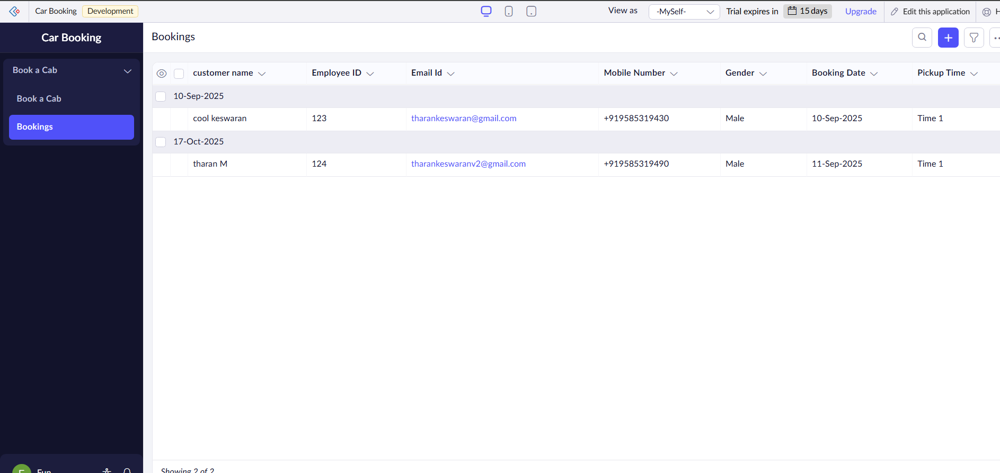
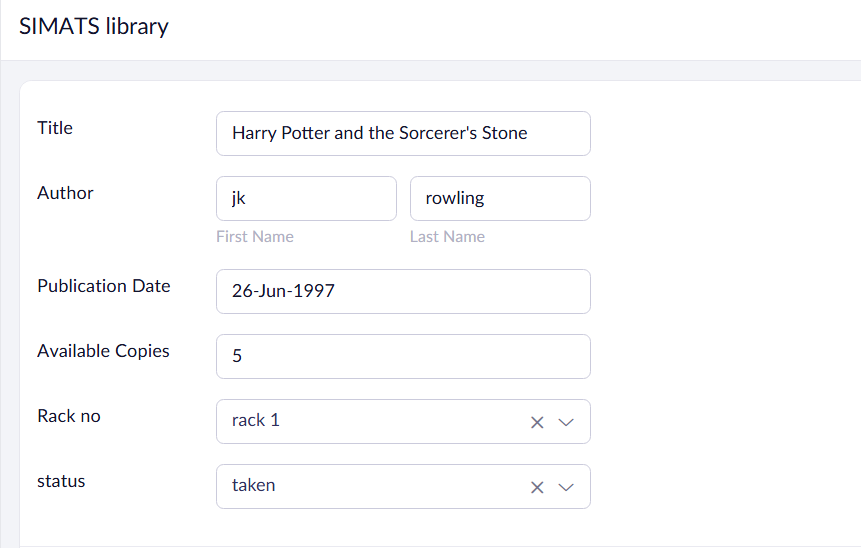
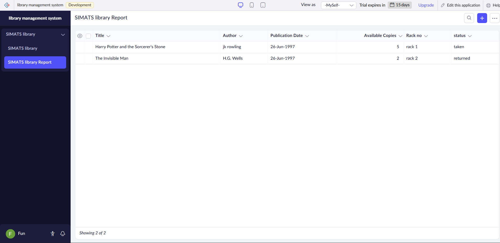
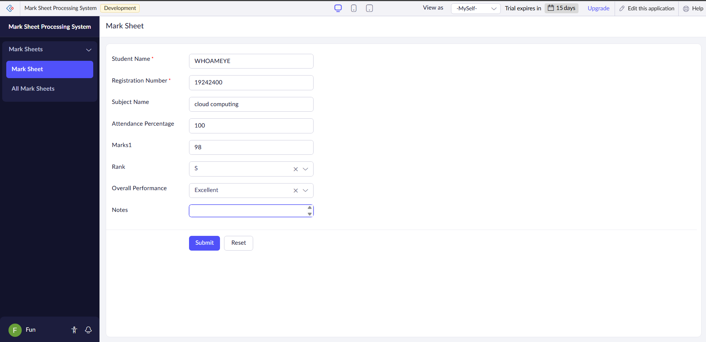
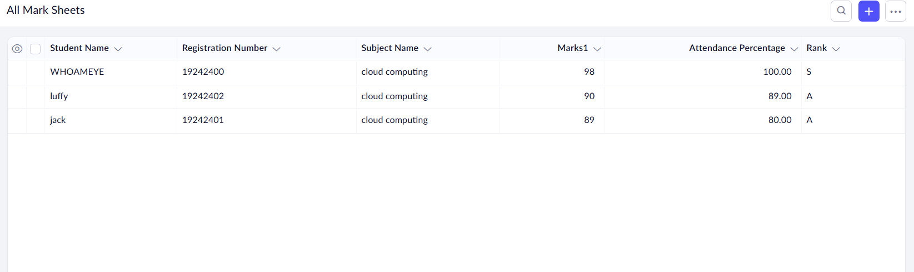

# CSA1525-cloud-computing-lab

This repository contains a collection of five cloud-based Software-as-a-Service (SaaS) applications demonstrating various business scenarios. Each application is designed to be deployed on zoho creator

## Applications Overview

## 1. Flight Reservation System ✈️
 A comprehensive flight booking system that handles both domestic and international flights.

**Key Features:**
- Flight search and booking
- Multiple trip types: One-way and Round-trip
- Advanced search filters:
  - Origin and Destination
  - Departure and Return dates
  - Number of travelers
  - Class selection (Economy/Business/First)
  - Fare type options
- International and Domestic flight categorization
- Real-time seat availability
- Multiple airport support
- Interactive route visualization

## 2. Property Buying & Rental System 🏠
A real estate management system

**Key Features:**
- Property listing types:
  - Buy
  - Rent
  - Commercial properties
- Rental agreement management
- Location-based search:
  - Area selection
  - Place/locality
  - Price range filter
- Property details:
  - Property value assessment
  - Area specifications
  - Location details
  - Property type
  - Rental agreement status
### 🏡 Property Listings Form

### 📊 All Property Listings Report

## 3. Car Booking Reservation System 🚗
A comprehensive car rental and booking management system.

**Key Features:**
- Employee ID, email, mobile, and gender capture
- Pickup and destination address with full details (city, state, postal code)
- Travel date and pickup time selection
- Outstation trip support
- Centralized booking report with search and filtering
 ### 🚗 Car Booking Form
   
 ### Car Bookings Report
   

## 4. SIMATS Library Management System 📚
A digital library management system for SIMATS library.

**Key Features:**
- Book management:
  - Title tracking
  - Author information
  - Year of publication
- Inventory management:
  - Number of copies
  - Rack number allocation
  - Status tracking (Available/Taken)
 ### 📚 Library Book Entry Form
   
### 📋 SIMATS Library Report

## 5. Mark Sheet Processing System 📊
An academic grade management and processing system.
**Key Features:**
- Student information:
  - Name
  - Registration number
  - Subject details
- Academic tracking:
  - Individual subject marks
  - Attendance percentage
  - Overall performance
- Results processing:
  - Average calculation
  - Percentage computation
  - Rank determination
 ### 📝 Mark Sheet Entry Form
   
### 📋 All Mark Sheets Report

## Author 👨‍💻

 

---

  

